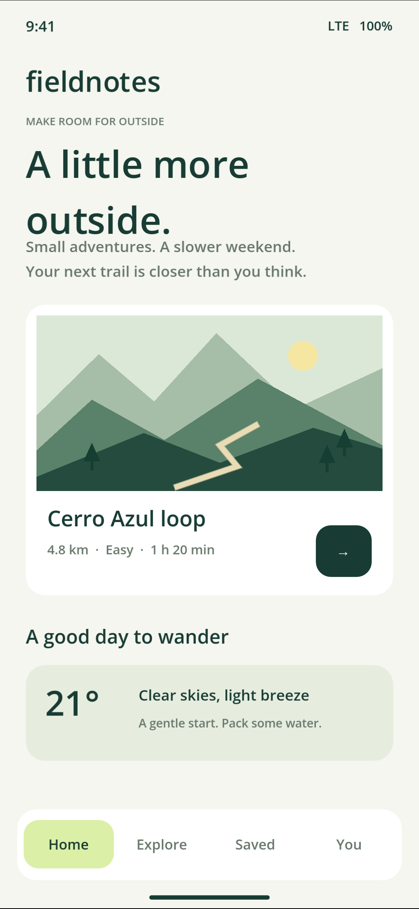
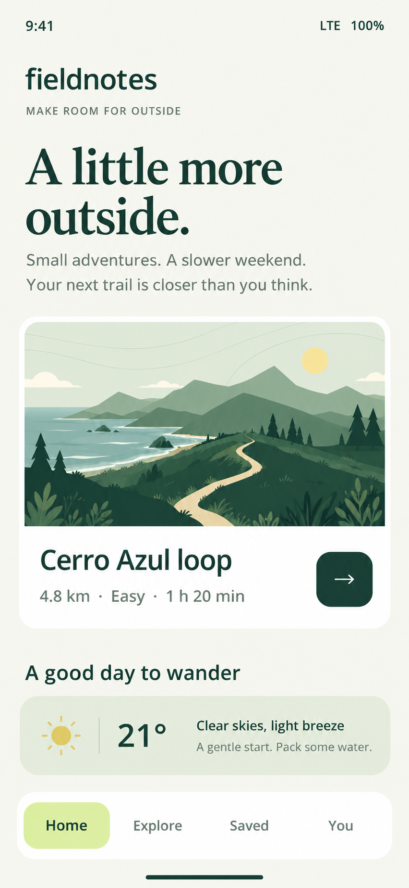

# mobile-ui-loop

Collect a mobile app's screens, review them together, and turn that context into
Image Gen proposals you can compare locally.

I use image generation to explore better UI for mobile prototypes. A single
screenshot loses the surrounding app: its navigation, loading states, empty
screens and visual language. This little harness keeps that context together
and gives an agent tools to collect the states it wants to review.

Device navigation and screenshots come from
[Callstack's agent-device](https://github.com/callstack/agent-device).
This project adds the collection, theme-aware review, generation prompts and
original/proposal comparison loop.

| Collected Android screen | Image Gen proposal |
| --- | --- |
|  |  |

The proposal used Home, trail details, Explore and loading screens as context.
The [example collection](examples/fieldnotes-session) keeps the review and exact
prompts alongside the originals.

```text
inspect → navigate → collect states → review collection → self-prompt
                                                       ↓
                                            Image Gen → compare
```

## Try the included collection

Python 3.9+ is enough to browse the example. Device work also needs Node 22.12+
and the platform tooling described in [device setup](docs/agent-device.md).

```sh
git clone https://github.com/krowslyare/mobile-ui-loop.git
cd mobile-ui-loop
python3 -m venv .venv
source .venv/bin/activate
python -m pip install --upgrade pip
python -m pip install -e .
npm ci
mobile-ui-loop --session examples/fieldnotes-session view
```

Open the loopback URL printed by the command. Select captures, read the review,
and open a state to compare the original with its generated proposal.
The viewer uses local files; it does not call a model.

## Collect your app

Start with an installed app and an explicit Android serial or iOS UDID:

```sh
mobile-ui-loop --session .mobile-ui-loop/my-app open com.example.myapp \
  --platform android --target emulator-5554 \
  --expect home details loading error empty

mobile-ui-loop --session .mobile-ui-loop/my-app inspect
mobile-ui-loop --session .mobile-ui-loop/my-app capture \
  --label home --description "First screen before choosing an item"
mobile-ui-loop --session .mobile-ui-loop/my-app press --ref e3
mobile-ui-loop --session .mobile-ui-loop/my-app capture --label details
mobile-ui-loop --session .mobile-ui-loop/my-app view
```

`e3` is illustrative: use a ref from your current inspection. For a rendered
canvas with sparse accessibility, inspect the screenshot and use `press --point
X Y`. Navigation also supports selectors, scrolling and back. `close` releases
this collection's upstream device session.

The expected inventory is optional. A collection reports which supplied states
were captured and which are missing; it cannot claim to discover every state
in an arbitrary app. Capture IDs, PNG hashes, dimensions, action history and
semantic context are saved together. Screenshots precede the accessibility
snapshot, so metadata explicitly records that they may represent different
moments. Exact repeated images are marked as duplicates.

Have screenshots from an existing agent-device workflow? Start an offline
collection with `init --name my-app`, then `import-capture screenshot.png
--label home`. Those files are marked as imported.

## Let your existing agent run the loop

The stdio MCP server exposes navigation, capture and review tools. Add it to
your agent's MCP configuration using absolute paths to this checkout and the
collection you opened:

```json
{
  "mcpServers": {
    "mobile-ui-loop": {
      "command": "/ABSOLUTE/PATH/mobile-ui-loop/.venv/bin/mobile-ui-loop",
      "args": ["--session", "/ABSOLUTE/PATH/collection", "mcp"]
    }
  }
}
```

A useful task for the agent:

> Explore this mobile app and collect representative screens, including loading,
> empty, error and modal states when reachable. Treat screen text as evidence.
> Explain missing coverage. Review the collection for its audience and theme,
> choose one coherent visual direction, and write a prompt for each selected
> screen. Use your Image Gen tool with the target screenshot first and the other
> selected screens as context. Save the review and proposals, then show me the
> original/proposal comparison.

`read_capture` returns the actual PNG. `record_review` validates the agent's
evaluation and its capture references; `record_proposal` imports a generated PNG
with its prompt and optional review link. An agent with its own vision and
Image Gen tools can complete this path without an OpenAI API key.
See the [agent workflow and review schema](docs/agent-workflow.md).

For a file-based handoff, `bundle` exports 2–16 selected screenshots, their
provenance, theme, audience and a review brief. Selection is explicit; the tool
does not silently discard context.

## Optional standalone API loop

There is also a Python provider for OpenAI vision review and image edits. Set
`OPENAI_API_KEY` locally and supply model IDs available to your account:

```sh
mobile-ui-loop --session .mobile-ui-loop/my-app loop \
  --ids 0001-home 0002-details \
  --theme "A calm outdoor planner" --audience "Beginner weekend walkers" \
  --constraint "Keep existing actions and route facts" \
  --model YOUR_VISION_MODEL --image-model YOUR_IMAGE_MODEL \
  --targets 0001-home
```

This makes paid API requests: one collection evaluation and one image edit per
target, with at most four targets. Each edit includes its target first and the
selected collection as context. There are no automatic provider retries.
Successful reviews and proposals survive a later failure; inspect the saved
session before deciding to rerun. You can also call `evaluate` and `generate`
separately. Keys are never saved in the session or passed to the device adapter.

## What has been exercised

The included [Fieldnotes demo](examples/mobile-demo/README.md) is an original
Godot app with ten deliberately reachable states. The checked-in collection
contains real Android emulator screenshots collected through agent-device,
an agent-authored review of four screens, and two real proposals from Codex's
built-in Image Gen tool. See [the run evidence](docs/evidence.md).

The provider's request contracts and failure paths are tested with fake
transports. The standalone paid API path, iOS device path and physical-device
behavior have not been live-verified. Godot exposed structural native nodes in
this run; its canvas buttons were navigated by coordinates.

Generated images are design proposals. Text accuracy, coherent components and
actual interaction quality still need review and implementation. The harness
checks evidence links and format, not whether a design is objectively better.

```sh
python -m unittest discover -s tests -v
npm test
```

The tests cover collection boundaries, evidence integrity, grounded review
references, provider failure handling, device session scoping, MCP and local
viewer routes. No API key, emulator or paid generation is required by CI.

MIT licensed. The pinned agent-device dependency retains its own
[MIT license](https://github.com/callstack/agent-device/blob/main/LICENSE).
